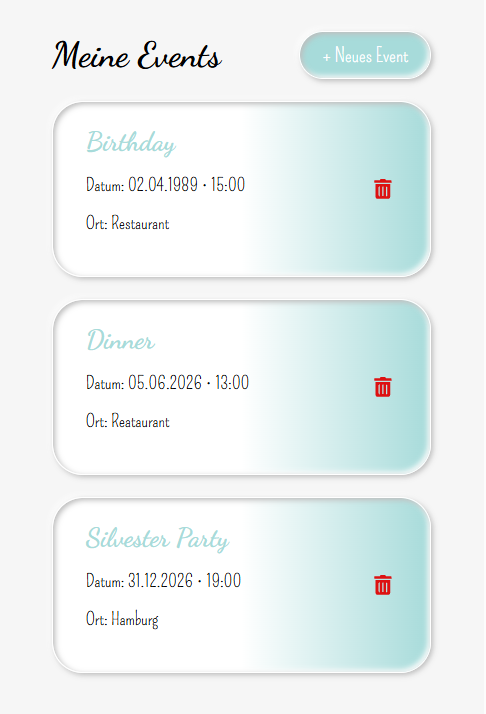

# 🎉 Event Planner – Frontend

A modern and lightweight event planning application built with **React** and structured using **Feature-Sliced Design (FSD)** architecture.

This application allows users to create and manage events, guests, tasks, dishes, and shopping lists in a clean, responsive, and performance-optimized interface.

---
## 🚀 Demo

🔗 **Try the application here:** 
[https://nutrition-analysis-serenityscript.netlify.app/](https://nutrition-analysis-serenityscript.netlify.app/)

[](https://nutrition-analysis-serenityscript.netlify.app/)

---
## ✨ Features

- 🗓 Create, edit, and manage events
- 👥 Guest management with attendance status
- ✅ Task tracking with completion state
- 🍽 Dish planning with responsibility assignment
- 🛒 Shopping list with category and purchase tracking
- 🔁 Real-time UI updates after CRUD operations
- 💬 Custom confirmation modal (no external UI libraries)
- ⚡ Lazy-loaded pages (code splitting)
- 🎨 Consistent design system using SCSS Modules
- 📱 Mobile-friendly UI

---
## 🏗 Architecture

This project follows **Feature-Sliced Design (FSD)** principles:

- **app/** – application setup (routing, providers)
- **pages/** – route-level pages
- **features/** – business features
- **entities/** – core domain models
- **widgets/** – composite UI blocks
- **shared/** – reusable UI & utilities

---
## 🧠 Architectural Decisions

- Feature-Sliced Design structure
- Route-based lazy loading
- Barrel files to simplify and standardize imports
- Scoped SCSS Modules
- Minimal dependency approach

---
## 🚀 Performance Optimizations

- React `lazy()` + `Suspense` for route-based code splitting
- Minimal dependency footprint
- Custom lightweight confirmation modal instead of heavy UI libraries
- Scoped SCSS Modules to avoid global CSS overhead

---
## 🧠 Technical Stack

- **React 18**
- React Router
- Vite
- SCSS Modules
- Feature-Sliced Design
- REST API integration
- Custom lightweight UI components

---
## 🎨 Design Decisions

### Why no UI framework?

Instead of using heavy UI libraries (e.g., MUI, Ant Design), this project relies on:

- Custom SCSS Modules
- Lightweight reusable components
- Mobile-first layout approach
- Minimal bundle size

This keeps the application:

- Fast
- Lightweight
- Fully customizable

---
## 📂 Project Structure
```
src/
├── app/
│ ├── providers/
│ ├── router/
│
├── pages/
│ ├── EventsListPage/
│ ├── EventDetailsPage/
│
├── features/
│ ├── EditEvent/
│ ├── DeleteDish/
│ ├── DeleteGuest/
│
├── entities/
│ ├── Event/
│
├── widgets/
│ ├── EventLayout/
│ ├── EventTabs/
│ ├── TasksPanel/
│
├── shared/
│ ├── ui/
│ │ ├── Button/
│ │ ├── Modal/
│ │ ├── Confirm/
│ ├── api/
```
---
## 🧩 Lazy Loading Example

Pages are dynamically loaded using React lazy:

```javascript
export const EventDetailsPage = lazy(() =>
  import("./ui/EventDetailsPage")
); 
```

Wrapped with:
```
<Suspense fallback={<div>Loading...</div>}>
  <Routes />
</Suspense>
```
---
## 🔐 Custom Confirmation System

Instead of using window.confirm, the application includes a lightweight custom confirmation system.

### Benefits:

- Consistent UI
- Mobile-friendly interaction
- Lightweight implementation
- Fully customizable

---
## 📱 Responsive Design

- Optimized for mobile interaction
- Clean minimal layout
- No hover-dependent interactions
- Large touch-friendly buttons

---
## 📦 Installation
git clone <your-repo-url>
cd event-planner-frontend
npm install
npm run dev

---
## 🛠 Future Improvements

- Toast notification system
- Drag & drop task reordering
- User authentication
- Dark mode support
- Persistent storage for filters

---
## 👩‍💻 Author

Yulia Siebrandt
Frontend Developer
Hamburg, Germany